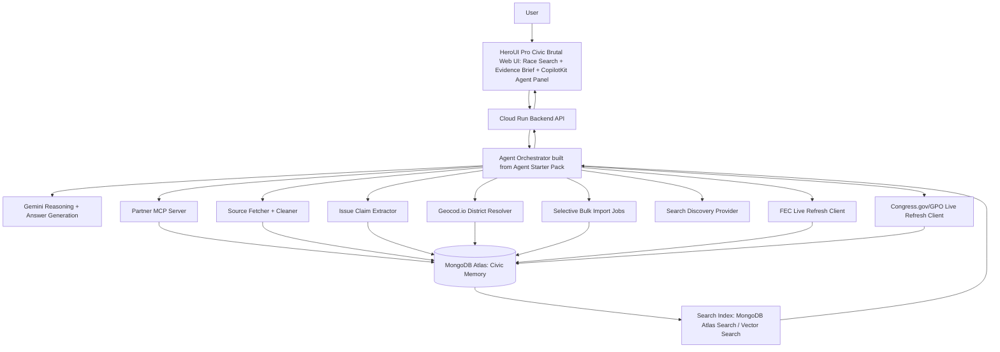

# DistrictLens Hackathon Technical Architecture

**Author:** Manus AI  
**Date:** May 07, 2026 (revised 2026-05-08)  
**Primary track architecture:** MongoDB MCP + Google Agents CLI / ADK + Gemini 3.1 (Pro reasoning, Flash-Lite extraction)

> Updated 2026-05-08 per [DECISIONS_LOG.md](./DECISIONS_LOG.md): Elastic alternate track dropped (§3.1); Gemini 3.1 versions specified (§3.3); HeroUI references mean OSS HeroUI not Pro (§1.1); CopilotKit↔ADK wires through Next.js proxy (§2.2).

## 1. Architecture thesis

DistrictLens should be implemented as a **tool-using civic intelligence agent**, not as a static voter-guide dashboard. The hackathon requires a functional agent that can reason, plan, and execute tasks with partner MCP integration. Therefore, the architecture must make the agent’s multi-step work visible: it should retrieve bulk-imported structured race records from MongoDB, inspect campaign-finance freshness, enrich incumbents with Congress.gov/GPO-derived records, optionally refresh official APIs, discover and fetch candidate issue sources, extract issue claims, validate evidence, and produce a cited answer under user oversight.[1]

The recommended primary architecture uses **MongoDB Atlas as the agent memory and operational data platform**. MongoDB stores bulk-imported official records, normalized entities, source documents, extracted claims, cached API/refresh responses, freshness metadata, and user-visible briefs. The agent accesses these records through a MongoDB MCP integration so that partner technology is part of the agent’s tool loop, not merely a passive database.[3]

## 2. High-level system diagram

## 3. Deployment topology

DistrictLens should use a simple deployment topology that is realistic for a hackathon but extensible after the event. The frontend can be deployed on Cloud Run or a static host. The backend agent API should run on Cloud Run. Secrets should be stored in Google Secret Manager. Agent orchestration should follow the Google Cloud Agent Starter Pack structure where possible, because the hackathon resources explicitly list Agent Starter Pack, Agent Builder, Agent Runtime, Secret Manager, and Cloud Run as recommended build/deployment components.[2] [4]

| Layer | Recommended service | Responsibility | Hackathon importance |
|---|---|---|---|
| Frontend | Cloud Run web service or static hosting with HeroUI Pro + CopilotKit | HeroUI Pro provides the Civic Brutal dashboard shell, cards, tables, charts, and drawers; CopilotKit provides agent chat, typed generative UI cards, and frontend tools. | Supports Design judging criterion and makes agent work visible without sacrificing deterministic civic UI. |
| Agent backend | Cloud Run | Exposes `/api/agent/ask`, `/api/races`, `/api/ingest/*`, and `/api/evidence/*`. | Shows production-shaped implementation. |
| Reasoning model | Gemini through Google Cloud Agent Builder or SDK path | Plans tool calls, summarizes evidence, produces cited answers. | Required by hackathon framing. |
| Orchestration scaffold | Agent Starter Pack | Project structure, deployment conventions, observability hooks, local/dev workflows. | Aligns with official resources. |
| Partner MCP | MongoDB MCP Server | Lets the agent query and update civic memory through partner tooling. | Required partner integration story. |
| Data store | MongoDB Atlas | Stores bulk-imported races, candidates, finance snapshots, member records, legislative actions, source docs, issue claims, freshness metadata, refresh outputs, optional user-owned saved artifacts, and cached briefs. | Primary partner value. |
| Retrieval | MongoDB Atlas Search and Vector Search | Retrieves source documents and extracted claims for answer grounding. | Supports explainability and speed. |
| External APIs | Geocod.io, FEC, Congress.gov/GPO, search API | Address-to-district lookup, official-data refresh, legislative enrichment refresh, and source discovery. | Proves real-world data integration without making all reads API-dependent. |
| Auth | Clerk | Optional sign-in for saved districts, saved briefs, preferences, correction submissions, and protected admin/import/refresh operations. | Keeps the civic demo public while supporting real user workspaces. |
| Secret management | Google Secret Manager or local `.env` for MVP | Stores API keys securely. | Required for safe deployment. |

## 4. Agentic mission flow

The central mission should be implemented as an explicit workflow. The agent may plan dynamically, but the MVP should include deterministic guardrails so that civic answers remain traceable.

| Step | Agent action | Tool or service | Stored output |
|---|---|---|---|
| 1 | Interpret user goal and identify race, candidate, issue, or district. | Agent orchestrator + entity resolver | `query_context` object |
| 1A | If the user provides an address, ZIP code, or coordinates, resolve district context. | Geocod.io district resolver | `district_lookups`, candidate `race_key` values, ambiguity warnings |
| 2 | Query stored races and candidates. | MongoDB MCP Server | Candidate list and `race_key` |
| 3 | If race data is stale or missing, refresh candidate data from FEC and upsert MongoDB. | FEC refresh client | `official_refresh_logs`, `candidates`, `races` |
| 4 | Retrieve finance snapshots and committee relationships from MongoDB; refresh FEC if freshness policy requires it. | MongoDB + FEC refresh client | `finance_snapshots`, `committees`, `official_refresh_logs` |
| 5 | If incumbent exists, retrieve imported legislative record and refresh Congress.gov/GPO when missing or stale. | MongoDB + Congress.gov/GPO refresh client | `legislative_actions`, `member_records`, `official_refresh_logs` |
| 6 | Retrieve existing issue evidence. | MongoDB Atlas Search / Vector Search through MCP | `issue_claims`, `source_documents` |
| 7 | If evidence is insufficient and user allows discovery, discover source URLs. | Search provider such as Perplexity | `source_discovery_results` |
| 8 | Fetch and clean source pages. | Source fetcher | `source_documents` with content hash |
| 9 | Extract and validate candidate issue claims. | Claim extractor + JSON schema | `issue_claims` |
| 10 | Generate answer with citations and limitations. | Gemini + answer composer | `brief_cache`, response payload |

## 5. Partner MCP integration boundary

The hackathon requirement is not satisfied by simply using a partner database behind the scenes. The demo must show the agent using the partner’s MCP server as part of a task. For the MongoDB primary track, the agent should expose the following MCP-backed capabilities.

| MCP-backed capability | Example user-facing task | Data touched |
|---|---|---|
| `resolve_district_by_address` | “What House district am I in for 2026?” | `district_lookups`, `races`, `candidates` |
| `find_race_by_location` | “Show me the NY-04 House race.” | `races`, `candidates` |
| `get_candidate_finance_snapshot` | “How much has each candidate raised?” | `finance_snapshots`, `committees` |
| `search_issue_evidence` | “What have candidates said about housing?” | `issue_claims`, `source_documents` |
| `store_extracted_issue_claims` | “Add evidence from these campaign pages.” | `source_documents`, `issue_claims` |
| `get_cached_civic_brief` | “Give me the latest neutral brief for this race.” | `brief_cache` |

> Elastic alternate-track paragraph removed 2026-05-08 — see [DECISIONS_LOG.md](./DECISIONS_LOG.md) §3.1. MongoDB Atlas Search + Atlas Vector Search cover all retrieval needs.

## 6. Data architecture

DistrictLens uses four data classes. **Bulk-imported official data** is stored in MongoDB from FEC, Congress.gov, and GovInfo/GPO. **Live official refresh data** comes from APIs when records are missing, stale, or user-requested. **Evidence documents** come from campaign pages, questionnaires, official statements, local reporting, and other citeable sources. **Agent-generated artifacts** include extracted claims, confidence labels, and cached briefs. The product should never treat agent-generated artifacts as primary evidence; they are interpretations linked back to source documents.

| Collection | Purpose | Primary key or index |
|---|---|---|
| `district_lookups` | Cached Geocod.io address, coordinate, ZIP, district, proportion, and raw response metadata. | `lookup_hash + field_set + cycle` |
| `races` | Race entity built from FEC candidates. | `race_key` |
| `candidates` | Candidate identity and classification. | `fec_candidate_id` |
| `committees` | Committee records linked to candidates. | `committee_id` |
| `finance_snapshots` | Receipts, disbursements, debts, cash, independent expenditures, import batch metadata, and freshness status where available. | `candidate_id + cycle + report_period` |
| `member_records` | Congress.gov member profiles for incumbents. | `bioguide_id` |
| `legislative_actions` | Sponsored/cosponsored bills, subjects, summaries, related bills, laws, bill text links, votes, and freshness metadata. | `source_id + action_id` |
| `source_documents` | Full fetched source content with metadata, hashes, and source type. | `source_id` |
| `issue_claims` | Extracted candidate issue-position evidence with quote, stance, confidence, and citation. | `claim_id` |
| `official_import_batches` | Import job metadata, source scope, record counts, checksums, and status. | `import_batch_id` |
| `official_refresh_logs` | Agent-triggered or scheduled refresh checks against FEC, Congress.gov, and GovInfo/GPO. | `refresh_id` |
| `brief_cache` | Cached race brief responses with citation graph and freshness metadata. | `race_key + issue + version` |

## 7. Retrieval and grounding strategy

The answer pipeline must be retrieval-first. Gemini should not answer from general memory about candidates. The orchestrator should retrieve candidate, finance, legislative, and issue evidence from the database/search layer, then ask Gemini to summarize only the retrieved evidence. If evidence is missing, the answer must say so.

| Evidence type | Retrieval method | Answer rule |
|---|---|---|
| Candidate identity | MongoDB exact query by FEC ID or race key. | Can state directly with FEC citation. |
| Campaign finance | MongoDB exact query over imported FEC snapshots; live FEC refresh if stale or requested. | Can summarize totals with import/check timestamp and FEC citation. |
| Incumbent record | MongoDB exact query over Congress.gov/GPO-derived records; live refresh if stale or requested. | Can describe sponsorships, cosponsorships, related bills, laws, bill text links, and votes with official citation. |
| Issue positions | Hybrid or semantic search over `issue_claims` and `source_documents`. | Must include quote, source type, date if available, and confidence. |
| Missing evidence | Retrieval returns no validated claim. | Must say “No direct evidence found in indexed sources.” |

## 8. Authentication stance

The hackathon demo should not start with a login wall. Clerk may be implemented as an optional layer, but DistrictLens must allow anonymous users to complete the core civic workflow: district lookup, race selection, candidate comparison, evidence inspection, and basic agent Q&A. Do not require sign-in before the public civic workflow: district lookup, race pages, evidence viewing, and basic agent answers must stay anonymous-friendly.

| Route class | Access rule | Demo risk control |
|---|---|---|
| Public civic reads | Anonymous allowed. | Judges can test immediately. |
| Public agent Q&A | Anonymous allowed with rate limits. | Demo remains smooth while limiting abuse. |
| Saved user artifacts | Clerk session required. | Optional enhancement; hide if Clerk keys are unavailable. |
| Admin import, refresh, extraction, indexing | Clerk admin role and/or server-only secret required. | Prevents public mutation of official-data cache. |

## 9. API surface for the MVP

The backend should expose a narrow API surface that Claude Code can implement quickly. Ingestion endpoints can be admin-only or local-only for the hackathon MVP.

| Endpoint | Method | Purpose |
|---|---|---|
| `/api/health` | `GET` | Service health and dependency status. |
| `/api/district/lookup` | `POST` | Resolve address, ZIP, or coordinates to district context through Geocod.io and map to likely race keys. |
| `/api/races` | `GET` | Search races by cycle, office, state, district, candidate, or party. |
| `/api/races/{race_key}` | `GET` | Return race detail, candidates, finance snapshots, and evidence summary. |
| `/api/agent/ask` | `POST` | Run a cited agent response for a race, candidate, issue, or finance question. |
| `/api/admin/import/fec/candidates` | `POST` | Bulk/selectively import and normalize FEC candidates for selected cycle and office. |
| `/api/admin/import/fec/finance` | `POST` | Bulk/selectively import finance summaries for selected candidates or races. |
| `/api/admin/refresh/fec` | `POST` | Refresh stale or requested FEC records and upsert MongoDB. |
| `/api/admin/import/congress/member` | `POST` | Import and enrich an incumbent member record. |
| `/api/admin/refresh/congress` | `POST` | Refresh stale or requested Congress.gov/GPO member, bill, or vote records and upsert MongoDB. |
| `/api/evidence/discover` | `POST` | Discover candidate source URLs, with user/operator approval if needed. |
| `/api/evidence/extract` | `POST` | Fetch sources and extract validated issue claims. |

## 10. Failure modes and guardrails

A civic agent must be honest about limitations. DistrictLens should prefer incomplete but accurate answers over complete-sounding unsupported answers. Guardrails should be implemented in tests, prompt rules, and response composition logic.

| Failure mode | System behavior |
|---|---|
| FEC or Congress.gov rate limit or missing API key | Use imported MongoDB records and show freshness timestamp; if no cache exists, explain configuration requirement. |
| Congress.gov cannot match a non-incumbent | Explain that non-incumbents do not have a current congressional voting record in indexed data. |
| Search finds snippets but source fetch fails | Store discovery metadata but do not cite or summarize unfetched snippets as evidence. |
| Candidate has no issue evidence | State that no direct evidence was found in indexed sources. |
| User asks whom to vote for | Refuse to recommend a candidate and offer neutral evidence comparison. |
| User asks for partisan persuasion targeting a demographic | Refuse targeted persuasion and offer nonpartisan factual information. |

## 10. Detailed demo architecture path

For the hackathon demo, the team should pre-ingest a small set of races and then allow one live agent mission. The live mission should be constrained enough to avoid API rate-limit surprises but dynamic enough to prove agent behavior.

| Demo phase | Precomputed | Live during demo |
|---|---|---|
| Race identity | 3–5 races imported from FEC into MongoDB. | User selects or searches a race. |
| Finance | Finance snapshots imported into MongoDB. | Agent retrieves cached finance and can refresh FEC for latest data. |
| Incumbent enrichment | At least one incumbent enriched from Congress.gov/GPO import. | Agent retrieves legislative context and can refresh current status. |
| Issue evidence | Several source documents and issue claims stored. | Agent retrieves evidence and may discover one additional source if network is reliable. |
| Partner MCP | MongoDB MCP configured. | Agent queries race, finance, and issue evidence through MCP-visible actions. |
| Guardrail test | Refusal prompts tested. | User asks “Who should I vote for?” and agent refuses appropriately. |

## CopilotKit agent UI layer

DistrictLens should use CopilotKit for the MVP agent-facing frontend layer. CopilotKit should power the right-side DistrictLens copilot panel, typed generative UI cards, and browser-side frontend tools. The main dashboard should remain deterministic React so that civic information is stable, inspectable, and accessible.

| CopilotKit surface | DistrictLens use |
|---|---|
| Chat or sidebar panel | Ask DistrictLens, suggested questions, cited answer stream, and limitation statements. |
| `useComponent` generative UI | `DistrictBriefCard`, `CandidateCompareCard`, `FinanceSnapshotChart`, `IssueEvidenceCard`, `ToolTraceTimeline`, and `DistrictAmbiguityPrompt`. |
| Frontend tools | `selectRace`, `openEvidenceDrawer`, `focusCandidate`, `setIssueFilter`, and `requestFullAddress`. |
| Shared state | Keep selected race, selected issue, address ambiguity, and source drawer state synchronized between the React dashboard and the ADK agent. |
| Guardrail boundary | Only registered typed components may be agent-rendered; arbitrary political persuasion UI is not allowed. |

OpenUI is not recommended for the hackathon critical path. It can be evaluated after the MVP if the team wants a compact streaming language for more open-ended dashboard composition.

## 11. References

[1]: https://rapid-agent.devpost.com/ "Google Cloud Rapid Agent Hackathon Overview"  
[2]: https://rapid-agent.devpost.com/resources "Google Cloud Rapid Agent Hackathon Resources"  
[3]: https://rapid-agent.devpost.com/details/mongodb-resources "MongoDB Resources for Google Cloud Rapid Agent Hackathon"  
[4]: https://github.com/GoogleCloudPlatform/agent-starter-pack "Google Cloud Agent Starter Pack"  
[5]: https://api.open.fec.gov/developers/ "FEC OpenFEC API"  
[6]: https://api.congress.gov/ "Congress.gov API"  
[7]: https://www.geocod.io/docs/ "Geocod.io API Reference"  
[8]: https://docs.copilotkit.ai/ "CopilotKit Docs"  
[9]: https://docs.copilotkit.ai/adk "CopilotKit ADK Integration"

## Agents CLI Overlay

DistrictLens should be implemented with **Google Agents CLI** as the primary scaffold and deployment workflow. The Agent Starter Pack remains a reference, but Agents CLI gives Claude Code a concrete sequence: run `uvx google-agents-cli setup`, scaffold `districtlens-agent`, implement the ADK tools, run local prompts, run evaluations, and deploy. This keeps the build aligned with Google Cloud agent tooling while reducing custom orchestration work.

| Architecture Concern | Agents CLI Decision |
|---|---|
| Initial project structure | Use `agents-cli scaffold districtlens-agent`. |
| Agent framework | Use the ADK/Gemini structure generated by Agents CLI. |
| Tool implementation | Add FEC, Congress.gov, source-discovery, MongoDB MCP, and optional Elastic tools as structured ADK tools. |
| Local testing | Use `agents-cli run` for tool-call smoke tests. |
| Evaluation | Use `agents-cli eval run` for citation, neutrality, and source-grounding evals. |
| Deployment | Use `agents-cli deploy` where possible; otherwise deploy the web/API layer to Cloud Run while preserving the Agents CLI scaffold. |

See `docs/AGENTS_CLI_IMPLEMENTATION.md` for the required Claude Code build sequence.

## State and local election overlay

DistrictLens should **not extend into local or non-federal races during the hackathon MVP**. The existing federal flow remains the core demo. A future contest-oriented ballot layer can represent governor, state senate, state house, county, municipal, judicial, school-board, and ballot-measure contests after provider access and validation workflows are ready.

| Layer | State/local extension |
|---|---|
| Geography | Use Geocod.io for normalized address, congressional district, state legislative district, county, municipality, and ambiguity warnings. |
| Ballot contests | **Post-MVP only.** Do not implement current local/state race lookup for the hackathon. Keep future provider notes in documentation. |
| State legislative context | Use OpenStates for incumbent state legislators, bills, votes, committees, and legislative history. |
| Fallback ingestion | **Post-MVP only.** Avoid official local CSV/JSON ingestion unless used as a private research artifact outside the main demo. |
| Agent UI | CopilotKit should focus on federal candidate comparison, evidence exploration, and source transparency. Any ballot-style local selector should be disabled or labeled post-MVP. |
| Guardrails | The agent must label unsupported elections and source freshness instead of implying national completeness. |

Recommended live flow: `address → Geocod.io geography → BallotReady/CivicEngine or Ballotpedia current ballot contests → Democracy Works or official calendars for election guidance → MongoDB contest cache → official source verification → OpenStates/Vote Smart enrichment → source discovery and issue evidence extraction → cited CopilotKit answer`. Google Civic may appear only as a labeled fallback.

## 12. Frontend design-system layer: HeroUI Pro + Civic Brutal

DistrictLens should use **HeroUI Pro** as the deterministic React design system for the dashboard and **CopilotKit** as the agent-interaction layer. HeroUI Pro should provide the app shell, Sidebar, Command Palette, Data Grid, KPI cards, charts, evidence sheets, source-trace timelines, and ballot-contest grouping views. CopilotKit should sit inside that shell as the right-side agent panel and should render only approved HeroUI-based generative UI components.

The selected visual direction is **Civic Brutal**, a restrained adaptation of HeroUI Pro's Brutalism theme. It should use strong slate/black borders, high-contrast typography, white or off-white panels, compact labels, and limited civic accents. Party color should appear only as metadata pills and never dominate a screen.

The HeroUI Pro MCP is a **development-time** assistant for Claude Code to inspect Pro component APIs, theme variables, CSS classes, and Brutalism examples. It is not part of the deployed runtime and must not be confused with the MongoDB or Elastic MCP used for hackathon partner-track scoring.

## Optional Local Race Discovery Bridge

Because Google Civic can be stale for current state and local races, DistrictLens should avoid local-race promises in the hackathon MVP. The optional Perplexity + TabStack bridge is now a post-MVP concept only. The demo should instead show a polished federal workflow with evidence-backed claims, FEC finance, Congress.gov context, and clear district resolution.

## Legislator Enrichment Import Layer

DistrictLens should include a selective import from `unitedstates/congress-legislators` as part of the MongoDB-first data architecture. This import enriches congressional candidate and incumbent cards with **Bioguide-centered identity, official webpages, official social accounts, district offices, current committee assignments, FEC crosswalk IDs, and photo resolver metadata**. Congress.gov and GovInfo/GPO remain the authoritative layer for legislative records, and FEC remains the authoritative layer for finance records.

The import should run as a protected admin operation and upsert into MongoDB collections rather than being fetched at request time. Public reads should render from MongoDB, while admin refreshes can update the enrichment cache before a demo or whenever the source repository changes.
