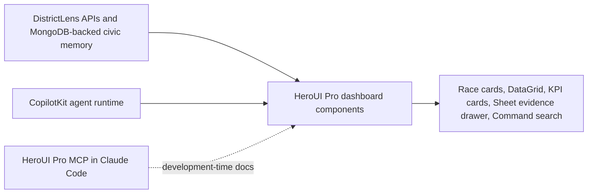

# HeroUI Pro Brutal Theme Decision for DistrictLens

> **STATUS: SUPERSEDED 2026-05-08** — DistrictLens now uses **OSS HeroUI** (`@heroui/react`, MIT) with a hand-rolled Civic Brutal Tailwind theme. The HeroUI Pro premise of this document conflicts with the public Apache 2.0 repository requirement (Pro source cannot be redistributed publicly). Retained for historical context and the Civic Brutal aesthetic rationale, which still applies. See [DECISIONS_LOG.md](./DECISIONS_LOG.md) §1.1.

**Author:** Manus AI  
**Date:** May 07, 2026  
**Decision:** Adopt **HeroUI Pro** as the primary deterministic UI framework for DistrictLens, using a restrained **Civic Brutal** variant of the Brutalism theme. Keep **CopilotKit** as the agent-interaction layer.

## Recommendation

DistrictLens should use HeroUI Pro because it directly matches the product’s need for a polished, data-heavy civic research interface. The official HeroUI Pro documentation describes it as a premium extension of HeroUI OSS for React and React Native, with **47+ React components**, **404+ examples**, production templates, premium themes including Brutalism and Glass, a Theme Builder, Figma files, and AI tooling including an MCP server.[1] [2] These capabilities map well to DistrictLens’s dashboard requirements: Sidebar navigation, Data Grid tables, KPI cards, charts, command/search surfaces, sheets/drawers, and chat-like evidence panels.

The Brutalism theme should be used, but not in an overly expressive or chaotic way. DistrictLens is a civic transparency product, not a campaign microsite. The recommended style is **Civic Brutalism**: strong black or slate borders, hard-edged cards, high-contrast typography, clear grid structure, and restrained accent colors. Party red/blue should remain small metadata only. The app should feel memorable and judge-friendly while preserving nonpartisan trust.

> **Decision rule:** HeroUI Pro owns the dashboard, evidence workspace, cards, charts, tables, sheets, and theme tokens. CopilotKit owns the right-side agent panel, frontend tool calls, typed generative UI, and human-in-the-loop interactions.

## Fit analysis

| Question | Assessment | Implication for DistrictLens |
|---|---|---|
| Does it support a serious civic dashboard? | Yes. HeroUI Pro includes dashboard-friendly components such as Data Grid, KPI cards, charts, Sidebar, Sheet, Command Palette, and templates.[1] | Use HeroUI Pro for the Race Overview, Candidate Compare, Money Flow, Source Trace, and Ballot views. |
| Does Brutalism fit the brand? | Yes, if moderated. Brutalism gives DistrictLens a distinct visual identity, but raw brutalism can feel too loud for civic data. | Define a **Civic Brutal** theme with neutral base colors, strong borders, and limited color accents. |
| Does it replace CopilotKit? | No. HeroUI Pro is the design-system layer; CopilotKit remains the agent UX layer. | Register HeroUI-based components as the visual components CopilotKit can render. |
| Does the MCP server help implementation? | Yes. The Pro MCP lets an AI coding assistant inspect `@heroui-pro/react` docs, CSS tokens, BEM classes, theme variants, and setup guides.[3] | Add `.mcp.json` setup instructions, but require the user’s private `HEROUI_PERSONAL_TOKEN` outside the repository. |
| Is there licensing risk? | Manageable. The landing FAQ says end products can be open source, but Pro source code must not be redistributed publicly.[4] | Keep the hackathon repo private if it includes copied Pro source. Do not publish HeroUI Pro component source in public artifacts. |
| Does it increase build risk? | Low to moderate. It adds package setup and theme decisions but removes custom UI work. | Adopt the framework, but limit custom theming to a single stable Civic Brutal theme for MVP. |

## Architecture placement

HeroUI Pro should sit entirely in the frontend layer. It should not affect DistrictLens’s data authority model, agent orchestration, Geocod.io district resolution, FEC finance ingestion, Congress.gov legislative enrichment, BallotReady/Ballotpedia-first ballot strategy with Democracy Works calendars and Google Civic fallback, or MongoDB MCP memory layer. It is a presentation and interaction design system.

In practical terms, Claude Code should build DistrictLens screens with HeroUI Pro components and use the Pro MCP to look up precise APIs while coding. The deployed user-facing app does not need to call the HeroUI MCP at runtime. The MCP is a **developer acceleration tool**, not an application dependency.

## Component mapping

| DistrictLens surface | Recommended HeroUI Pro / HeroUI pattern | CopilotKit role |
|---|---|---|
| App shell | Sidebar, top command/search, responsive layout | None, except surfacing suggested actions. |
| District lookup | Form controls, Command Palette, cards | Agent can explain ambiguous districts and request clarification. |
| Race overview | KPI cards, cards, badges/chips, charts | Agent summarizes race context. |
| Candidate comparison | Data Grid plus candidate cards | Agent can render typed comparison cards from retrieved data. |
| Money flow | Charts, KPI cards, table rows | Agent explains finance findings with FEC citations. |
| Issue evidence | Sheet/drawer, evidence cards, source timeline | Agent opens source trace and answers with citations. |
| State/local ballot layer | Grouped cards, Data Grid, filters | Agent resolves ballot ambiguity and explains source coverage gaps. |
| Right-side agent panel | HeroUI shell plus CopilotKit chat/generative components | CopilotKit remains the core runtime. |

## Implementation rules

The MVP should import the Brutalism theme from HeroUI Pro and then override it into a restrained civic theme. The visual language should use white or near-white panels, slate/black borders, high contrast body text, compact labels, and one civic accent such as cyan or gold. Avoid large partisan backgrounds, campaign-like gradients, or playful political icons.

The package should add a `HEROUI_PERSONAL_TOKEN` placeholder for local MCP setup only. Runtime deployment should not require this token unless the build process pulls private Pro packages during CI. If CI needs private package access, use the appropriate HeroUI automation token and store it in the deployment secret manager rather than in source control.

## References

[1]: https://heroui.pro/docs/react/getting-started "HeroUI Pro React Introduction"  
[2]: https://heroui.pro/ "HeroUI Pro landing page"  
[3]: https://heroui.pro/docs/react/getting-started/mcp-server "HeroUI Pro MCP Server"  
[4]: https://heroui.pro/ "HeroUI Pro FAQ and licensing notes"  
